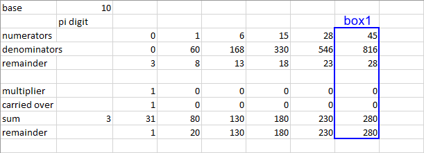

# Summary
This is simple study project from this list: https://github.com/karan/Projects

**Find PI to the Nth Digit** - Enter a number and have the program generate PI up to that many decimal places. Keep a limit to how far the program will go

# Solution
I'm going to use spigot algorithm, Gosper formula


Arbitrary large numbers will be used only for pi. I.e. algorithm will be able to produce as many digits as user request but after some number of digits (~100k)
this won't be pi digits any more

I'm using Gosper's formula over Rabinowitz and Wagon because it converge faster

# Spigot algorithm basics
From [wikipedia](https://en.wikipedia.org/wiki/Spigot_algorithm):<br />
> A spigot algorithm is an algorithm for computing the value of a mathematical constant such as π or e which generates output digits in some base (usually 2 or a
power of 2) from left to right, with limited intermediate storage. The name comes from the sense of the word "spigot" for a tap or valve controlling the flow of
a liquid.

This mean that spigot algorithm give us ability to compute pi digits one after another in a cycle: iteration1 → 3; iteration2 → 1; iteration3 → 4; …

# Computation
First of all keep in mind that this is not math description. If you want to learn why does it work you need to do some investigations. Check links at the end of
this file, "Resources" section

I'm going to split algorithm description into 2 sections. "Algorithm steps" section contain "map" of algorithm. This section introduce variables and show why
you need them. "Details" section help to learn how to get (calculate) those variables. This [excel](resources/piSpigot.xlsx) file may help as it contain some
examples.

## Algorithm steps
1. initialize *number of boxes*, *base*, *numerators*, *denominators*, *remainders*
2. fore each box calculate
   1. *multiplier*
   2. *carried over* (to next box)
   3. *sum*
   4. update *remainder*
6. return pi digit

## Details
First let's define some constants. Though first i will need to define *box* – set of all variables required for one iteration. When all boxes calculated we gain
another pi digit. I.e. this is sort of memory analogue. You could also imagine that all variables values required to calculate one digit are table rows. In this
table column is a box


```number of boxes = 0.9 * required number of digits + 1```<br />
here *required number of digits* is positive integer user should define (type)

*base* – is numeral system base. In this application case ```base = 10```

*numerators* – Gosper formula fractions numerators array: *0, 1, 2 * 3 = 6, 3 * 5 = 15, 28 = 4 * 7, …, (i + 1) * (2i + 1)*, here *i* is simply iterator

*denominators* – Gosper formula fractions denominators array: *0, 4 * 5 * 3 = 60, 7 * 8 * 3 = 168, 10 * 11 * 3 = 330, …, i * (i + 1) * 3*, here *i* is simply
iterator

And variables. 

*remainders* – this is also Gosper formula elements array but unlike *numerators* and *denominators* we going to need to update values. <br />
```new remainder = sum % denominator```<br />
here *sum* will be defined later, *denominator* – this box *denominators* array element for all steps but last, when you calculate pi digit. In this case
*denominator = base*<br />
initialization (first pi digit): 3, 8, 13, 18, 23, 28, …, k + 5; here k is previous value

*multiplier* – part of Euclidean division, operation in which you divide integers and get integers *a/b = c * d + e*, here a, b, c, d, e – integers;
d – multiplier<br />
```multiplier = floor (previous box sum / previous box denominator)```<br />
here *previous box sum* and *previous box denominator* in first box both equal to 0, because no previous calculations. Thus in first box *multiplier = 0* to
resolve 0 / 0 uncertainty.

```carried over = multiplier * previous box numerator```

```sum = remainder * 10 + carried over```

```pi digit = floor (sum / base)```

# Resources
[Wikipedia](https://en.wikipedia.org/wiki/Spigot_algorithm)<br />
Math [web](https://www.maa.org/sites/default/files/pdf/pubs/amm_supplements/Monthly_Reference_12.pdf), (same pdf) [local file](resources/Monthly_Reference_12.pdf)<br />
Lots of interesting algorithm including [pi spigot Rabinowitz and Wagon](http://www.cut-the-knot.org/Curriculum/Algorithms/SpigotForPi.shtml)<br />
"The world of pi" site, spigot [page](http://www.pi314.net/eng/goutte.php)